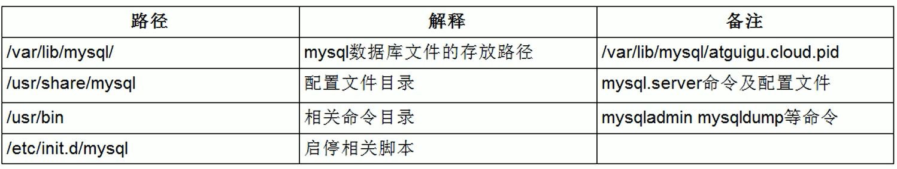

# mysql的架构介绍

## Mysql简介

### 概述

- 是一个关系型数据库系统。
- 是一种关联数据库管理系统，将数据保存在不同的表中，增加了速度提高了灵活性。
- 是开源的。
- 是支持大型的数据库。
- 是可以定制的，可以修改源码开发自己的MySQL数据库
- 使用标准的SQL数据语言形式。

### 高级MySQL

mysql内核

sql优化工程师

MySQL服务器的优化

各种参数常量设定

查询语句优化

主从复制

软硬件升级

容灾备份

sql编程

## Mysql Linux版的安装(centos 6)

service mysql start/stop/restart

首次安装完没有密码,设置root密码为123456

mysql -u root password 123456

自启动mysql服务(centos较低版本)

chkconfig mysql on

mysql data文件夹可以通过ps -ef|grep mysql中的--datadir查看

默认

## Mysql配置文件

## Mysql逻辑架构介绍

## MySQL存储引擎

# 索引优化分析

性能下降SQL慢

执行时间长

等待时间长

常见通用的Join查询

索引简介

性能分析

索引优化

# 查询截取分析

# MySql锁机制

# 主从复制