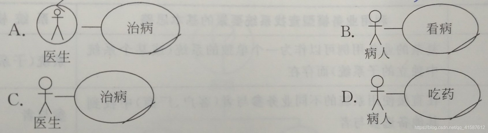
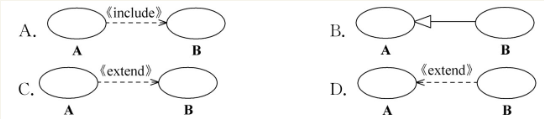
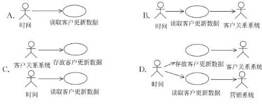

# 选择

## 人机交互

### 不是人机交互经历的阶段是（）。

- *A、*[语音命令交互阶段](javascript:void(0))
- *B、*[命令行交互阶段](javascript:void(0))
- *C、*[图形用户界面交互阶段](javascript:void(0))
- *D、*[自然和谐的人机交互阶段](javascript:void(0))

正确答案： A 我的答案：A

## 第一章 类与对象

#### 对象技术是( )。

- *A、*[一系列指导软件构造的原则](javascript:void(0))
- *B、*[一种新的已被认可的理论](javascript:void(0))
- *C、*[Booch发明的一种新的设计语言](javascript:void(0))
- *D、*[一种使用UML建模的思想](javascript:void(0))

正确答案： A 我的答案：A

#### 下列有关类的定义,正确的是( )。

- *A、*[对象的抽象](javascript:void(0))
- *B、*[多个对象的集合](javascript:void(0))
- *C、*[对象的实例](javascript:void(0))
- *D、*[描述对象层次结构](javascript:void(0))

正确答案： A 我的答案：A

#### 下列( )之间的关系是类和对象之间的关系。

- *A、*[老师和学生](javascript:void(0))
- *B、*[老师和张老师](javascript:void(0))
- *C、*[张老师和王同学](javascript:void(0))
- *D、*[张老师和李老师](javascript:void(0))

正确答案： B 我的答案：B

## 第二章 UML

#### 模型是( )。

- *A、*[现实世界的简化](javascript:void(0))
- *B、*[现实世界的图形化描述](javascript:void(0))
- *C、*[现实世界的具体化描述](javascript:void(0))
- *D、*[现实世界的封装](javascript:void(0))

正确答案： A 我的答案：A

#### 下列关于UML的论述,错误的是( )。

- *A、*[将几个面向对象方法统一起来](javascript:void(0))
- *B、*[可作为与软件开发人员之间的通用语言](javascript:void(0))
- *C、*[可作为一种指导软件开发的通用过程](javascript:void(0))
- *D、*[可用于通用领域,也可用于嵌入式领域](javascript:void(0))

正确答案： C 我的答案：C

#### UML中的“统一”体现在很多方面,下列选项( )不是UML统一的内容。

- *A、*[开发生命周期](javascript:void(0))
- *B、*[软件开发过程](javascript:void(0))
- *C、*[应用领域](javascript:void(0))
- *D、*[实现语言和平台](javascript:void(0))

正确答案： B 我的答案：B

#### 和UML 1.x相比,UML 2进行了比较大的改动,对于普通用户来说,主要的改动体现在对一些图进行了调整。下列4个选项中,( )是UML 2新增的用于描述静态结构的图。

- *A、*[类图](javascript:void(0))
- *B、*[交互概览图](javascript:void(0))
- *C、*[时间图](javascript:void(0))
- *D、*[组合结构图](javascript:void(0))

正确答案： D 我的答案：D

## 第三章 业务建模

#### 下列有关业务建模的概念和方法的论述中,错误的是()

- *A、*[业务建模是软件开发的必备环节](javascript:void(0))
- *B、*[可以采用用例技术进行业务建模](javascript:void(0))
- *C、*[可以通过活动图详细描述业务流程](javascript:void(0))
- *D、*[业务模型可以映射到系统模型](javascript:void(0))

正确答案： A 我的答案：A

> 答案解析：

> 业务建模是对业务不了解时帮助理解,它只是辅助环节,P60 活动图可用于:①描述业务用例or系统用例,实现对业务流程、工作流和系统处理流程的建模。②描述算法,实现对系统内部类方法的建模。③对发杂信息系统建模,以确定系统处理信息的层次关系和流程。Rational统一过程(Rational Unified Process,RUP)核心思想:用例驱动、以架构为中心的迭代增量开发。业务建模的主要任务:拟定目标组织对新系统的远景(Vision),并根据该远景来定义业务模型中组织的过程、角色和指责。业务模型 = 业务用例模型(Business Use-Case Model 说明业务预期功能的模型:①识别业务参与者Business Actor ②识别业务用例Business Use Case ③利用活动图描述业务用例) + 业务对象模型(Business Object Model分为静态/动态模型,注重业务中承担的角色及其指责:①业务工人Business Worker ②业务实体Business Entity ③业务用例实现Business Use Case Realization)

#### 下列有关业务模型的相关概念中,错误的是()

- *A、*[业务参与者在业务之外](javascript:void(0))
- *B、*[业务工人在业务内部](javascript:void(0))
- *C、*[业务用例为业务工人提供价值](javascript:void(0))
- *D、*[业务实体在业务内部](javascript:void(0))

正确答案： C 我的答案：C

> 答案解析：

> P65 业务工人:在业务内部,承担职责的人;业务参与者:在业务外部,接受业务提供的服务的人或物;业务实体:在业务内部,所访问和操作的事物;业务用例:是对业务过程的抽象;业务用例实现:类图——显示参与的业务工人与业务实体间的静态结构;活动图——泳道显示业务工人的职责,对象流显示如何在工作流程中使用业务实体;顺序图——描述业务工人和业务参与者间交互的详细情况,显示如何在业务用例执行过程中访问业务实体

#### 下列关于活动图的论述中,错误的是()

- *A、*[可以包括多个起点](javascript:void(0))
- *B、*[分区用来表示该分区内的活动是否由谁负责](javascript:void(0))
- *C、*[活动可以简单,可以复杂](javascript:void(0))
- *D、*[可以使用活动图描述业务用例流程](javascript:void(0))

正确答案： A 我的答案：A 

> 答案解析：

> B. 分区用来表示该分区内的活动是否由谁负责 P64分区是常用的活动分组方式,分区条可水平/垂直;

#### 业务模型中的业务实体,在系统模型中最有可能成为()

- *A、*[活动](javascript:void(0))
- *B、*[参与者](javascript:void(0))
- *C、*[控制类](javascript:void(0))
- *D、*[实体类](javascript:void(0))

正确答案： D 我的答案：D

#### 以某海鲜酒家为研究对象,下列选项中,()是业务工人。

- *A、*[服务员](javascript:void(0))
- *B、*[菜单](javascript:void(0))
- *C、*[食客](javascript:void(0))
- *D、*[菜](javascript:void(0))

正确答案： A 我的答案：A

#### 下列选项中,()不会出现在活动图中。

- *A、*[活动](javascript:void(0))
- *B、*[用例](javascript:void(0))
- *C、*[对象](javascript:void(0))
- *D、*[分叉](javascript:void(0))

正确答案： B 我的答案：B

#### 针对以下研究对象,财务人员最有可能是业务参与者的是(A,C)

- *A、*[某省注册会计师考试委员会](javascript:void(0))
- *B、*[某市国税局](javascript:void(0))
- *C、*[公司人力资源部](javascript:void(0))
- *D、*[公司财务部](javascript:void(0))

正确答案： AC 我的答案：AC

#### 以某医院为研究对象，下列业务用例图中，正确的是（）

正确答案： B 我的答案：B

## 第四章 用例建模

### 下列选项中，关于业务参与者和系统参与者的论述，正确的是（ ）。

- *A、*[业务参与者一定是系统参与者](javascript:void(0))
- *B、*[系统参与者一定是业务工人](javascript:void(0))
- *C、*[系统参与者一定要与系统交互](javascript:void(0))
- *D、*[系统涉众一定是系统参与者](javascript:void(0))

正确答案： C 我的答案：C得分： 12.5分

### 下面4个选项中，（ ）肯定不能作为系统的参与者。

- *A、*[直接使用系统的人](javascript:void(0))
- *B、*[需要交互的外部系统](javascript:void(0))
- *C、*[系统自身的数据库](javascript:void(0))
- *D、*[时间](javascript:void(0))

正确答案： C 我的答案：C得分： 12.5分

### 下列选项中，（ ）不会出现在需求阶段的用例文档中。

- *A、*[基本事件流](javascript:void(0))
- *B、*[备选事件流](javascript:void(0))
- *C、*[用例实现场景](javascript:void(0))
- *D、*[前置条件](javascript:void(0))

正确答案： C 我的答案：C得分： 12.5分

### 下列有关用例文档相关内容的论述中，正确的是（ ）。

- A、

  涉众等同于参与者

- B、

  每个用例都应有前置条件和后置条件

- C、

  前置条件必须在用例开始执行前就能检测到

- D、

  编写用例的事件流时应尽可能细化各种实现细节

正确答案： C 我的答案：C得分： 12.5分

> 答案解析：

> A. 涉众等同于参与者，//涉众是指受用例所代表的业务影响的（或与当前用例有利益关系的）系统内外部人员或组织。外部系统、时间等不是涉众，因为没有利益影响 ， 但可以是参与者 。 
>
> B. 每个用例都应有前置条件和后置条件  P100 两者只是用例的可选特征，可以没有。
>
> C. 前置条件必须在用例开始执行前就能检测到   正确
> 
> D. 编写用例的事件流时应尽可能细化各种实现细节 //事件流应该是用用户可以理解的业务语言来描述。过度地采用技术语言会造成用户的误解，而达不到定义需求的目标。所以事件流中不应该细化实现细节，

### 在一个“订单管理子系统”中，创建新订单和更新订单都需要核查用户账号是否正确。那么，用例“创建新订单”“更新订单”与用例“核查客户账号”之间是（ ）关系。

- *A、*[包含](javascript:void(0))
- *B、*[扩展](javascript:void(0))
- *C、*[泛化](javascript:void(0))
- *D、*[实现](javascript:void(0))

正确答案： A 我的答案：A得分： 12.5分

### 考虑某客户服务系统，客服部人员接听完客户电话后，需要通过该系统记录客户来电的内容，则用例“记录客户来电”的前置条件最可能是（ ）。

- *A、*[有客户打来电话](javascript:void(0))
- *B、*[客服部人员已经登录](javascript:void(0))
- *C、*[客服部人员有空闲](javascript:void(0))
- *D、*[客服部人员接听完客户电话](javascript:void(0))

正确答案： B 我的答案：B得分： 12.5分

### 用例之间存在3种关系，即包含、扩展和泛化。已知用例A表示一般情况，而用例B是在用例A到达一个特定点时才发生的情况（该特定点可能到达，可能不到达），则下列4个选项中，（　）能正确表示A、B之间的关系。

正确答案： D 我的答案：D

### 某电信营销系统需要为营销人员提供各种客户数据的统计分析功能，而这些客户数据来自另一个外部系统——客户关系系统。客户关系系统定时（如24：00点）把客户数据的更新存放在某个约定的位置，营销系统也定时（如01：00点）去约定位置读取更新数据。请问以下用例图最准确地描绘了该营销系统有关客户数据更新功能需求的是（　　）。

正确答案： A 我的答案：A

## 第五章 用例分析

# 简答

## 什么是人机交互技术？

所谓人机交互（Human-Computer Interaction，HCI），是指关于设计、评价和实现供人们使用的交互式计算机系统，并围绕相关的主要现象进行研究的学。狭义的讲，人机交互技术主要是研究人与计算机之间的信息交换，它主要包括人到计算机和计算机到人的信息交换两部分。

## 简单介绍人机交互技术的研究内容？

人机交互的研究内容十分广泛，涵盖了建模、设计、评估等理论和方法，以及在Web、移动计算、虚拟现实等方面的应用研究，主要包括以下内容：

1）．人机交互界面表示模型与设计方法

一个交互界面的优劣，直接影响到软件开发的成败。友好的人机交互界面的开发离不开好的交互模型与设计方法。因此，研究人机交互界面的表示模型与设计方法是人机交互的重要研究内容之一。

2）．可用性分析与评估

可用性是人机交互系统的重要内容，它关系到人机交互能否达到用户期待的目标，以及实现这一目标的效率与便捷性。对人机交互系统的可用性分析与评估的研究主要涉及到支持可用性的设计原则和可用性的评估方法等。

3）．多通道交互技术

研究视觉、听觉、触觉和力觉等多通道信息的融合理论和方法，使用户可以使用语音、手势、眼神、表情等自然的交互方式与计算机系统进行通信。多通道交互主要研究多通道交互界面的表示模型、多通道交互界面的评估方法以及多通道信息的融合等。其中，多通道融合是多通道用户界面研究的重点和难点。

4）．认知与智能用户界面

智能用户界面（Intelligent User Interface，IUI）的最终目标是使人机交互和人－人交互一样自然、方便。上下文感知、三维输入、语音识别、手写识别、自然语言理解等都是认知与智能用户界面解决的重要问题。

5）．群件

群件是指为群组协同工作提供计算机支持的协作环境，主要涉及个人或群组间的信息传递、群组内的信息共享、业务过程自动化与协调以及人和过程之间的交互活动等。目前，与人机交互技术相关的研究内容主要包括群件系统的体系结构、计算机支持的交流与共享信息的方式、交流中的决策支持工具、应用程序共享以及同步实现方法等内容。

6）．Web设计

重点研究Web界面的信息交互模型和结构，Web界面设计的基本思想和原则，Web界面设计的工具和技术，以及Web界面设计的可用性分析与评估方法等内容。

7）．移动界面设计 移动计算（Mobile Computing）、普适计算（Ubiquitous Computing）等技术对人机交互技术提出了更高的要求，面向移动应用的界面设计已成为人机交互技术研究的一个重要内容。由于移动设备的便携性、位置不固定性、计算能力有限性以及无线网络的低带宽高延迟等诸多的限制，移动界面的设计方法、移动界面可用性与评估原则、移动界面导航技术以及移动界面的实现技术和开发工具，都是当前人机交互技术研究的热点之一。

## 简单介绍人机交互技术的发展历史

作为计算机系统的一个重要组成部分，人机交互技术一直伴随着计算机的发展而发展。人机交互技术的发展过程，也是从人适应计算机到计算机不断适应人的发展过程。它经历了如下几个阶段：

1）．命令行界面交互阶段

计算机语言经历了由最初的机器语言、汇编语言，直至高级语言的发展过程。这个过程也可以看作是人机交互的早期发展过程。

命令行界面可以看作第一代人机界面。

2）．图形用户界面（GUI）交互阶段

图形用户界面的出现使人机交互方式发生了巨大变化。GUI的主要特点是桌面隐喻、WIMP技术、直接操纵和“所见即所得”。与命令行界面相比，图形用户界面的自然性和交互效率都有较大的提高。

3）．自然和谐的人机交互阶段

当前，自然和谐的人机交互方式得到了一定的发展。基于语音、手写体、姿势、视线、表情等输入手段的多通道交互是其主要特点，目的是使人能以声音、动作、表情等自然方式进行交互操作。

近年来，强大的社会需求产生了各式各样的应用场景。要想实现自然和谐的人机交互关系，需要在进行交互设计时考虑物理、社会等不同的计算环境，理解人机交互的复杂本质，探索与之相关的社会的、自然的和认知的环境以及人们使用计算机的原因，将领域知识应用到系统设计中，并在此过程中逐步形成人机交互新方法，发现更新、更好的计算范式。这也是人机交互技术研究发展的趋势。

