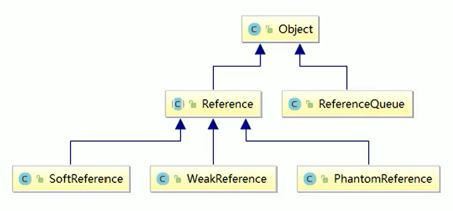

# 引用



## 强引用

当内存不足,JVM开始回收垃圾,对于强引用,就算是出现了OOM也不会对该对象进行回收,==死都不收==。

因此强引用是造成Java内存泄漏的主要原因之一。

```java
public class StrongReferenceDemo {
    public static void main(String[] args) {
        Object o1 = new Object();
        Object o2 = o1;
        o1 = null;
        System.gc();
        System.out.println(o2);
    }
}
/**
 * 运行结果
 * java.lang.Object@1b6d3586
 */
```

## 软引用

软引用是一种相对强引用弱化了一些的引用,需要用java.lang.ref.SoftReference类来实现,可以让对象豁免一些垃圾回收。

对于只有软引用的对象来说，

系统内存充足时 ==不会==被回收，

系统内存不足时 ==会==被回收。

软引用通常用在对内存敏感的程序中，比如高速缓存中用到软引用，内存够用就保留，不够就回收。

## 弱引用

## 虚引用