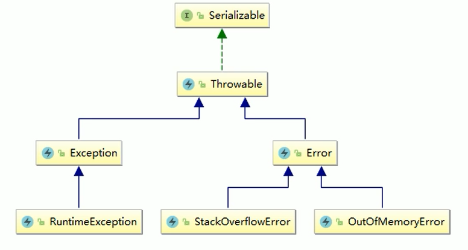

# OOM



内存溢出与栈溢出都是错误，不是异常。

## java.lang.StackOverflowError

函数无限递归

## java.lang.OutofMemoryError:Java heap space

new 大对象或者无限字符串拼接

## java.lang.OutofMemoryError:GC overhead limit exceeded

GC回收时间过长会导致GC overhead limit exceeded，超过98%的时间进行GC且回收了不到2%的堆内存，连续多次GC回收不到2%的极端情况下才会抛出。

## java.lang.OutofMemoryError:Direct buffer memory

写NIO程序经常使用ByteBuffer来读取或者写入数据，这是一种基于通道(Channel)与缓冲区(Buffer)的I/0方式，
它可以使用Native函数库直接分配堆外内存，然后通过一个存储在Java堆里面的DirectByteBuffer对象作为这块内存的引用进行操作。这样能在一些场景中显著提高性能，因为避兔了在Java堆和Native堆中来回复制数据。
ByteBuffer.allocate(capability)第一种方式是分配JVM堆内存，属于GC管辖范围，由于需要拷贝所以速度相对较慢
ByteBuffer.allocteDirect(capability）第二种方式是分配OS本地内存，不属子GC管辖范围，由于不需要内存拷贝所以速度相对较快。但如果不断分配本地内存，堆内存很少使用，那么JVM就不需要执行GC，DirectByteBuffer对象们就不会被回收，
这时候堆内存充足，但本地内存可能已经使用光了，再次尝试分配本地内存就会出现OutOfMemoryError，那程序就直接崩溃了。

```java
public class DirectBufferDemo {
    public static void main(String[] args) {
        System.out.println(VM.maxDirectMemory() / 1024/1024);
        ByteBuffer bb = ByteBuffer.allocateDirect(6*1024*1024);
    }
}

-Xmx10m -Xms10m -XX:+PrintGCDetails -XX:MaxDirectMemorySize=5m
    
[Full GC (System.gc()) [PSYoungGen: 488K->0K(2560K)] [ParOldGen: 212K->598K(7168K)] 700K->598K(9728K), [Metaspace: 3115K->3115K(1056768K)], 0.0051858 secs] [Times: user=0.00 sys=0.00, real=0.01 secs] 
Exception in thread "main" java.lang.OutOfMemoryError: Direct buffer memory
```


