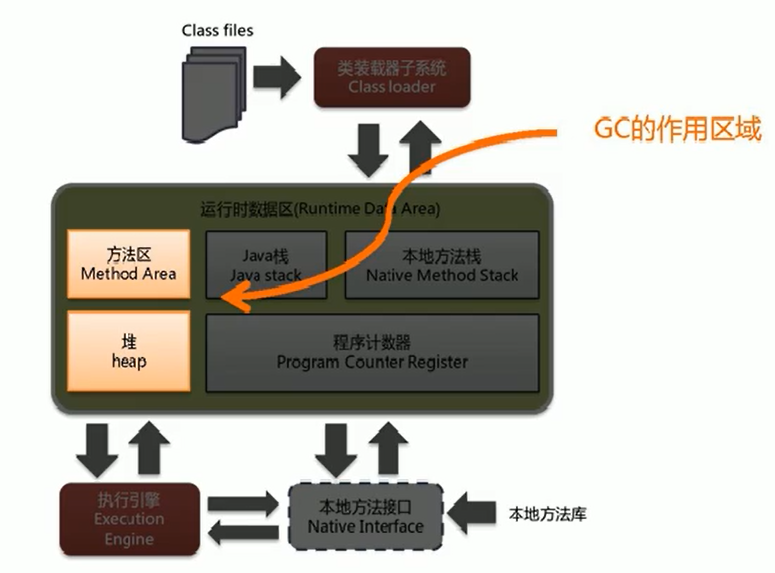
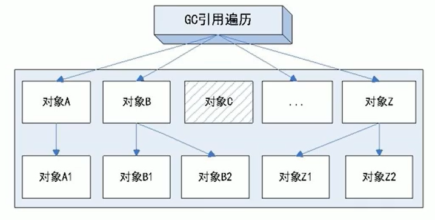
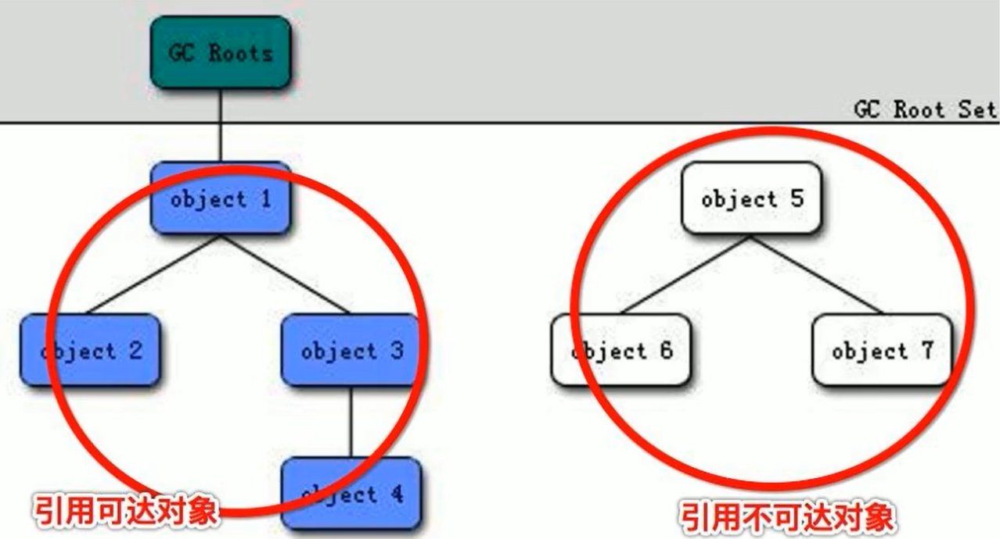

[TOC]

# 对 volatile 的理解

## volatile 是什么

- volatile 是 Java 虚拟机提供的一种轻量级的同步机制

  - 保证可见性

    - 可见性：一个线程修改了主物理内存的值，其他线程立马知道。(详细见下一章 JMM 是什么)
    - 代码证明：在主线程中使用一个新线程修改某个对象中==未加 volatile==修饰的变量，在主线程中使用 while 循环判断，会发现主线程无法退出循环，使用 volatile 修饰后可以退出循环。

  - 不保证原子性

    - 原子性：不可分割，完整性，某个线程在做某个业务时，中间不可以被加塞或分割，需要整体完整，要么全部成功，要么全部失败。
    - 代码证明：使用 20 个线程对==有 volatile 修饰==的变量进行 1000 次自增操作，运算结束后结果小于 20000。
    - 如何解决原子性：
      - 加 synchronized 修饰
      - 使用 AtomicInteger 替换 int 类型

  - 禁止指令重排

    - 在编译过程中，指令不一定按照编写的顺序进行编译，最终运行结果会与编写的顺序不同

    - 代码证明：

      ```java
      int x = 11;(1)
      int y = 12;(2)
      x = x+5;(3)
      y = x*x;(4)
      
      最终执行结果可以是
          (1)(2)(3)(4)
          (2)(1)(3)(4)
          (1)(3)(2)(4)
      由于存在依赖性，语句 (4) 不可能被重排至前面。
      ```

    - 代码证明 2：

      ```java
      int a,b,x,y = 0;
      ```

      | 线程 1 | 线程 2 |
      | ------ | ------ |
      | x = a; | y = b; |
      | b = 1; | a = 2; |

      正常无指令重排

      ```java
      x = 0;
      y = 0;
      b = 1;
      a = 2;
      ```

      指令重排后可能出现

      | 线程 1 | 线程 2 |
      | ------ | ------ |
      | b = 1; | a = 2; |
      | x = a; | y = b; |

      运行结果

      ```java
      x = 2;
      y = 1;
      a = 2;
      b = 1;
      ```

      


## JMM 是什么

> JMM 是 Java 内存模型,本身是一种抽象的概念==并不真实存在==，描述的是一组规则或规范，定义了程序中各个变量的访问方式。

线程安全性得到保证

**三大特性**

- 可见性
- 原子性
- 有序性

**可见性的具体描述**：

> 由于 JVM 运行程序的实体是线程，而每个线程创建时 JVM 都会为其创建一个工作内存 (有些地方称为栈空间)，工作内存是每个线程的私有数据区域，而 Java 内存模型中规定所有变量都存储在主内存，主内存是共享内存区域，所有线程都可以访问，但线程对变量	的操作 (读取赋值等) 必须在工作内存中进行，首先要将变量从主内存拷贝的自己的工作内存空间，然后对变量进行操作，操作完成后再将变量写回主内存，不能直接操作主内存中的变量，各个线程中的工作内存中存储着主内存中的变量副本拷贝，因此不同的线程间无法访问对方的工作内存，线程间的通信 (传值) 必须通过主内存来完成，其简要访问过程如下图:


## 在哪里使用到了 volatile

### 单例模式

```java
public static SingletonDemo getInstance(){
    if(instance == null){
        synchronized (SingletonDemo.class){
            if(instance == null){
                instance == new SingletonDemo();
            }
        }
    }
    return instance;
}

这种双端检锁机制的单例模式看起来没有问题，但由于指令重排，有可能造成 SingletonDemo 还没有被初始化完成时 instance 指向了将要被初始化的内存区域，此时如果有其他线程获取 instance，会判断为非空，但是实际上 instance 指向的内存区域是空内存。
    
因此需要在 instance 前添加 volatile 修饰。
```

# CAS

## 什么是 CAS？

CAS 就是比较并交换，==compare and swap==，是一条 CPU 并发原语。

在进行 CAS 操作时，==先对期望值与实际值进行比较==，如果相同，代表在之前没有线程修改过该对象，则此时可以修改。如果不同，代表之前有其他线程对该对象进行过操作，此时不能修改，否则将违背原子性。

## 底层原理？

自旋锁，unsafe 类

#### unsafe 类是什么？

unsafe 类是位于 rt.jar 中的一个类，其方法都是 native 方法，都直接调用操作系统底层资源执行相应任务。

unsafe 类通过 valueOffset 进行操作，valueOffset 即内存偏移量。

```java
public final int getAndIncrement(){
    return unsafe.getAndAddInt(this,valueOffset,1);
}

//****************************************

public final int getAndAddInt(Object var1,long var2,int var4){
    int var5;
    do {
        var5 = this.getIntVolatile(var1,var2); //获取对应的值
    } while(!this.compareAndSwapInt(var1,var2,var5,var5 + var4)); //cas 操作，成功则跳出循环
    return var5;
}
```

## 缺点？

- 由于有 do while 循环，循环时间长，cpu 开销大。
- 只能保证一个共享变量的原子性。
- 出现 ABA 问题。

# ABA 问题

## 怎么产生的？

狸猫换太子

比如说一个线程 one 从内存位置 V 中取出 A，这时候另一个线程 two 也从内存中取出 A，并且线程 two 进行了一些操作将值变成了 B，然后线程 two 又将 V 位置的数据变成 A，这时候线程 one 进行 CAS 操作发现内存中仍然是 A，然后线程 one 操作成功。

尽管操作成功，但是不能说明过程没有问题。

## 怎么解决？

### 原子引用

使用 stamp 来作为版本号记录变化，每次修改使 stamp 加一，这样便可以避免 ABA 问题

# 集合类不安全

## 并发修改异常

在使用 ArrayList 等线程不安全的集合类时，多线程环境下对集合进行操作会出现并发修改异常。

```java
java.util.ConcurrentModuificationException
```

#### 如何解决

- vector(弃用)
- Collections.synchronizedList(new ArrayList<>());
- CopyOnWriteArrayList()；

## 写时复制

CopyOnWriteArrayList()；实现方法即为写时复制。

> 先将 Array 复制一份，修改完成后，将原来的引用修改至新的 Array，实现了读写分离。

```java
public boolean add(E e) {
    final ReentrantLock lock = this.lock;
    lock.lock();
    try {
        Object[] elements = getArray();//复制
        int len = elements.length;
        Object[] newElements = Arrays.copyOf(elements, len + 1);//扩容
        newElements[len] = e;//add
        setArray(newElements);//修改引用
        return true;
    } finally {
        lock.unlock();
    }
}

final void setArray(Object[] a) {
    array = a;
}
```


## Set

==CopyOnWriteArraySet==底层使用了 CopyOnWriteArrayList 来实现。

## Map

使用==ConcurrentHashMap==解决 Map 线程不安全问题

# 锁

ReentrantLock() 默认是非公平锁，相当于 ReentrantLock(false)，相反的，ReentrantLock(true) 即为公平锁

非公平锁比公平锁的优点在于吞吐量大。

synchronized 也是一种非公平锁。

## 公平锁

多个线程按照申请锁的顺序来获取锁，先来后到

## 非公平锁

多个线程不是按照申请锁的顺序，有可能后申请的线程比先申请的线程优先获取锁，高并发的情况下有可能造成优先级反转或者饥饿现象。

## 可重入锁（递归锁）

### 是什么

同一线程外层函数获得锁之后，内层递归函数仍然能够获取该锁的代码，在同一线程外层方法获取锁的时候，在进入内层方法时会自动获取锁。

也就是说，==线程可以进入任何一个它已经拥有的锁所同步着的代码块==。

### 例子

ReentrantLock/Synchronized 就是典型的可重入锁。

### 作用

可重入锁最大的功能是避免死锁。	

### 代码验证

synchronized 是可重入锁。

```java
public void synchronized sendSMS(){
    //do something;
    sendEmail();
}

public void synchronized sendEmail(){
    //do somthing;
}

main(){
    sendSMS();
}

运行结果：
    短信发送成功
    邮件发送成功
```

ReentrantLock 是可重入锁

```java
Lock lock = new ReentrantLock();

public void sendSMS(){
    lock.lock();
    //do something;
    sendEmail();
    lock.unlock();
}

public void sendEmail(){
    lock.lock();
    //do somthing;
    lock.unlock();
}

main(){
    sendSMS();
}

运行结果：
    短信发送成功
    邮件发送成功
```

## 自旋锁

尝试获取锁的对象不会立即阻塞，而是==采用循环的方式去获取锁==，好处是减少了线程的上下文切换的消耗，缺点是循环会消耗 CPU。

### 手写自旋锁

```java
public class SpinLockDemo {
    AtomicReference<Thread> atomicReference = new AtomicReference<>();
    public void myLock(){
        Thread thread = Thread.currentThread();
        System.out.println(thread.getName()+" come in");
        while (!atomicReference.compareAndSet(null,thread)){
        }
    }
    public void myUnlock(){
        Thread thread = Thread.currentThread();
        atomicReference.compareAndSet(thread,null);
        System.out.println(thread.getName()+" unlocked");
    }
    
    public static void main(String[] args) {
        SpinLockDemo spinLockDemo = new SpinLockDemo();
        new Thread(() -> {
            spinLockDemo.myLock();
            try { TimeUnit.SECONDS.sleep(5); } catch (InterruptedException e) { e.printStackTrace(); }
            spinLockDemo.myUnlock();
        },"AA").start();
        new Thread(() -> {
            spinLockDemo.myLock();
            spinLockDemo.myUnlock();
        },"BB").start();
    }
}
//AA come in
//BB come in
//AA unlocked
//BB unlocked
```

## 独占锁

该锁一次只能被一个线程所持有。对 ReentrantLock 和 Synchronized 而言都是独占锁。

## 共享锁

指该锁可以被多个线程所持有

ReentrantReadWriteLock 其读锁是共享锁，写锁是独占锁

读锁的共享锁可保证并发读是非常高效的，读写，写读，写写的过程是互斥的


代码演示

```java
public class ReentrantReadWriteLockDemo {
    public static void main(String[] args) {
        MyCache myCache = new MyCache();
        for (int i = 0; i < 5; i++) {
            int finalI = i;
            new Thread(() -> {
                myCache.put(String.valueOf(finalI),String.valueOf(finalI));
            },String.valueOf(i)).start();
        }
        for (int i = 0; i < 5; i++) {
            int finalI = i;
            new Thread(() -> {
                myCache.get(String.valueOf(finalI));
            },String.valueOf(i)).start();
        }
    }
}

class MyCache{
    private volatile Map<String,Object> map = new HashMap<>();
    private ReentrantReadWriteLock readWriteLock = new ReentrantReadWriteLock();
    public void put(String key,Object value)
    {
        readWriteLock.writeLock().lock();
        try {
            System.out.println(Thread.currentThread().getName()+"写入。。。"+key);
            try { TimeUnit.SECONDS.sleep(1); } catch (InterruptedException e) { e.printStackTrace(); }
            map.put(key,value);
            System.out.println(Thread.currentThread().getName()+"写入完毕。。。");
        } catch (Exception e) {
            e.printStackTrace();
        } finally {
            readWriteLock.writeLock().unlock();
        }
    }
    public void get(String key)
    {
        readWriteLock.readLock().lock();
        try {
            System.out.println(Thread.currentThread().getName()+"读取。。。");
            try { TimeUnit.SECONDS.sleep(1); } catch (InterruptedException e) { e.printStackTrace(); }
            Object result = map.get(key);
            System.out.println(Thread.currentThread().getName()+"读取完毕。。。"+result);
        } catch (Exception e) {
            e.printStackTrace();
        } finally {
            readWriteLock.readLock().unlock();
        }
    }
}

0 写入。。。0
0 写入完毕。。。
1 写入。。。1
1 写入完毕。。。
4 写入。。。4
4 写入完毕。。。
2 写入。。。2
2 写入完毕。。。
3 写入。。。3
3 写入完毕。。。
2 读取。。。
1 读取。。。
0 读取。。。
4 读取。。。
3 读取。。。
2 读取完毕。。。2
4 读取完毕。。。4
1 读取完毕。。。1
3 读取完毕。。。3
0 读取完毕。。。0
```

# CountDownLatch/CyclicBarrier/Semaphore

## CountDownLatch

秦王灭六国，一统天下。

用来计数的类，在调用 await 方法时会阻塞，使用 countDown 方法使计数减一，计数减到 0 时可以放行线程。

```java
public class CountDownLatchDemo {
    public static void main(String[] args) throws InterruptedException {
        CountDownLatch countDownLatch = new CountDownLatch(6);//创建一个计数 6 次的计数器
        for (int i = 0; i < 6; i++) {
            new Thread(() -> {
                System.out.println(Thread.currentThread().getName()+"号同学离开教室");
                countDownLatch.countDown();
            },String.valueOf(i)).start();
        }

        countDownLatch.await();
        System.out.println("班长锁门");
    }
}
```


## CyclicBarrier

集齐七颗龙珠，召唤神龙。

用来计数的类，在调用 await 方法时会阻塞，计数增加到设定值时放行所有等待的线程，并进行操作。

```java
public class CyclicBarrierDemo {
    public static void main(String[] args) {
        CyclicBarrier cyclicBarrier = new CyclicBarrier(7,() -> {
            System.out.println("召唤神龙");
        });
        for (int i = 0; i < 7; i++) {
            new Thread(() -> {
                System.out.println(Thread.currentThread().getName()+"收集到龙珠！");
                try {
                    cyclicBarrier.await();
                } catch (InterruptedException e) {
                    e.printStackTrace();
                } catch (BrokenBarrierException e) {
                    e.printStackTrace();
                }
            },String.valueOf(i)).start();
        }
    }
}
```

## Semaphore

多个线程争夺多个资源时使用，类似对剩余资源的计数。

```java
public class SemaphoreDemo {
    public static void main(String[] args) {
        Semaphore semaphore = new Semaphore(3); //3 个资源
        for (int i = 0; i < 6; i++) {
            new Thread(() -> {
                try {
                    semaphore.acquire();
                    System.out.println(Thread.currentThread().getName()+"抢到车位！");
                    try { TimeUnit.SECONDS.sleep(1); } catch (InterruptedException e) { e.printStackTrace(); }
                } catch (InterruptedException e) {
                    e.printStackTrace();
                } finally {
                    semaphore.release();
                }
            },String.valueOf(i)).start();
        }
    }
}
```

# synchronized 与 Lock

## 有什么区别

### 原始构成

- synchronized 关键字属于 JVM 层面
- Lock 是具体的类（java.util.concurrent.locks.Lock）是具体层面的锁

### 使用方法

- synchronized 不需要用户手动释放锁，代码块执行结束后会自动释放锁。
- ReentrantLock 需要用户手动释放锁，若没有主动释放锁，可能造成死锁。
  - 需要 lock() 和 unlock() 方法配合 try/finally 使用

### 等待是否可中断

- synchronized 不可中断，除非抛出异常或者正常运行完成
- ReentrantLock 可中断。
  - 设置超时方法 tryLock(long timeout,TimeUnit unit)
  - lockInterruptibly() 放代码块中，调用 interrupt() 方法即可中断

### 加锁是否公平

- synchronized 非公平锁

- ReentrantLock 可设置公平或非公平，默认非公平锁

### 锁绑定多个条件 Condition

- synchronized 不支持
- ReentrantLock 用来实现分组唤醒的线程们，可以精确唤醒，而不是像 synchronized 要么随机唤醒一个线程要么唤醒全部线程。

### Condition 实例

```java
class ShareResource {
    // A 1   B 2   c 3
    private int number = 1;
    // 创建一个重入锁
    private Lock lock = new ReentrantLock();

    // 这三个相当于备用钥匙
    private Condition condition1 = lock.newCondition();
    private Condition condition2 = lock.newCondition();
    private Condition condition3 = lock.newCondition();


    public void print5() {
        lock.lock();
        try {
            // 判断
            while(number != 1) {
                // 不等于 1，需要等待
                condition1.await();
            }

            // 干活
            for (int i = 0; i < 5; i++) {
                System.out.println(Thread.currentThread().getName() + "\t " + number + "\t" + i);
            }

            // 唤醒 （干完活后，需要通知 B 线程执行）
            number = 2;
            // 通知 2 号去干活了
            condition2.signal();

        } catch (Exception e) {
            e.printStackTrace();
        } finally {
            lock.unlock();
        }
    }

    public void print10() {
        lock.lock();
        try {
            // 判断
            while(number != 2) {
                // 不等于 1，需要等待
                condition2.await();
            }

            // 干活
            for (int i = 0; i < 10; i++) {
                System.out.println(Thread.currentThread().getName() + "\t " + number + "\t" + i);
            }

            // 唤醒 （干完活后，需要通知 C 线程执行）
            number = 3;
            // 通知 2 号去干活了
            condition3.signal();

        } catch (Exception e) {
            e.printStackTrace();
        } finally {
            lock.unlock();
        }
    }

    public void print15() {
        lock.lock();
        try {
            // 判断
            while(number != 3) {
                // 不等于 1，需要等待
                condition3.await();
            }

            // 干活
            for (int i = 0; i < 15; i++) {
                System.out.println(Thread.currentThread().getName() + "\t " + number + "\t" + i);
            }

            // 唤醒 （干完活后，需要通知 C 线程执行）
            number = 1;
            // 通知 1 号去干活了
            condition1.signal();

        } catch (Exception e) {
            e.printStackTrace();
        } finally {
            lock.unlock();
        }
    }
}

public class SyncAndReentrantLockDemo {

    public static void main(String[] args) {

        ShareResource shareResource = new ShareResource();

        new Thread(() -> {
            for (int i = 0; i < 10; i++) {
                    shareResource.print5();
            }
        }, "A").start();

        new Thread(() -> {
            for (int i = 0; i < 10; i++) {
                shareResource.print10();
            }
        }, "B").start();

        new Thread(() -> {
            for (int i = 0; i < 10; i++) {
                shareResource.print15();
            }
        }, "C").start();
    }
}
```

另一种写法

```java
public class ConditionDemo {
    public static void main(String[] args) {
        ShareResource shareResource = new ShareResource();

        new Thread(() -> {
            for (int i = 0; i < 5; i++) {
                shareResource.print(5);
            }
        },"AA").start();
        new Thread(() -> {
            for (int i = 0; i < 5; i++) {
                shareResource.print(10);
            }
        },"BB").start();
        new Thread(() -> {
            for (int i = 0; i < 5; i++) {
                shareResource.print(15);
            }
        },"CC").start();

    }
}

class ShareResource{
    //A:1 B:2 C:3
    private int number = 1;
    private Lock lock = new ReentrantLock();
    private Condition c1 = lock.newCondition();
    private Condition c2 = lock.newCondition();
    private Condition c3 = lock.newCondition();

    public void print(int time){
        lock.lock();
        try {
            switch (Thread.currentThread().getName()){
                case "AA" : {
                    while (number != 1){
                        c1.await();
                    }
                    for (int i = 0; i < time; i++) {
                        System.out.println(Thread.currentThread().getName()+" "+i);
                    }
                    number = 2;
                    c2.signal();
                    break;
                }
                case "BB" : {
                    while (number != 2){
                        c2.await();
                    }
                    for (int i = 0; i < time; i++) {
                        System.out.println(Thread.currentThread().getName()+" "+i);
                    }
                    number = 3;
                    c3.signal();
                    break;
                }
                case "CC" : {
                    while (number != 3){
                        c3.await();
                    }
                    for (int i = 0; i < time; i++) {
                        System.out.println(Thread.currentThread().getName()+" "+i);
                    }
                    number = 1;
                    c1.signal();
                    break;
                }
                default:
            }
        } catch (Exception e) {
            e.printStackTrace();
        } finally {
            lock.unlock();
        }
    }

}
```

# 阻塞队列

## 性质

当队列为空时，从队列中获取元素的线程会被阻塞。

当队列为满时，向队列中添加元素的线程会被阻塞。

## 常用阻塞队列

- ==ArrayBlockingQueue==：用数组组成的有界（无默认值）阻塞队列
- ==LinkedBlockingQueue==：用链表组成的有界（默认为 Integer.MAX_VALUE）阻塞队列
- PriorityBlockingQueue：支持优先级排序的无界阻塞队列
- DelayQueue：使用优先级队列实现的延迟无界阻塞队列
- ==SynchronousQueue==：不存储元素的阻塞队列，即单个元素的阻塞队列 (put 方法必须等待一个 take 方法才可以结束)
- LinkedTransferQueue：由链表组成的无界阻塞队列
- LinkedBlocking**Deque**：有链表组成的双向阻塞队列

SynchronousQueue 代码演示

```java
public class SynchronousQueueDemo {
    public static void main(String[] args) {
        SynchronousQueue synchronousQueue = new SynchronousQueue();
        new Thread(() -> {
            try {
                System.out.println(Thread.currentThread().getName()+"put 1");
                synchronousQueue.put(1);
                System.out.println(Thread.currentThread().getName()+"put 2");
                synchronousQueue.put(2);
                System.out.println(Thread.currentThread().getName()+"put 3");
                synchronousQueue.put(3);
            } catch (InterruptedException e) {
                e.printStackTrace();
            }
        },"AAA").start();

        new Thread(() -> {
            try {
                try { TimeUnit.SECONDS.sleep(1); } catch (InterruptedException e) { e.printStackTrace(); }
                System.out.println(Thread.currentThread().getName()+"take");
                synchronousQueue.take();
                try { TimeUnit.SECONDS.sleep(1); } catch (InterruptedException e) { e.printStackTrace(); }
                System.out.println(Thread.currentThread().getName()+"take");
                synchronousQueue.take();
                try { TimeUnit.SECONDS.sleep(1); } catch (InterruptedException e) { e.printStackTrace(); }
                System.out.println(Thread.currentThread().getName()+"take");
                synchronousQueue.take();
            } catch (InterruptedException e) {
                e.printStackTrace();
            }
        },"BBB").start();
    }
}
AAAput 1
BBBtake
AAAput 2
BBBtake
AAAput 3
BBBtake

```


## 阻塞队列有没有好的一面

程序员不需要关心什么时候阻塞线程，什么时候唤醒线程，全部交给 BlockingQueue 来做。

## 如何使用

| 方法 | 抛出异常  | 特殊值   | 阻塞   | 超时               |
| ---- | --------- | -------- | ------ | ------------------ |
| 插入 | add(e)    | offer(e) | put(e) | offer(e,time,unit) |
| 移除 | remove()  | poll()   | take() | poll(time,unit)    |
| 检查 | element() | peek()   | 不可用 | 不可用             |

解释

- 抛出异常
  - 队列满时调用 add 方法会抛 IllegalStateException: Queue full 异常
  - 队列空时调用 remove 方法会抛 NoSuchElementException 异常
  - 队列空时调用 element 方法会抛 NoSuchElementException 异常
- 特殊值
  - 插入成功返回 true 插入失败返回 false
  - 队列空时调用 peek 方法返回 null
  - 队列空时调用 poll 方法返回 null
- 阻塞（官方示意图使用）
  - 队列满时调用 put 方法会阻塞线程
  - 队列空时调用 take 方法会阻塞线程
- 超时
  - 队列满时调用 offer(e,time,unit) 方法会尝试插入，time 时间后仍未插入成功则返回 false
  - 队列空时调用 poll(time,unit) 方法会尝试移除元素，time 时间后仍未移除成功则返回 false

## 不得不阻塞，如何管理

？？？

# 线程池

## 为什么用线程池

线程池做的主要工作就是控制运行的线程的数量，处理过程中，将任务放入到队列中，然后线程创建后，启动这些任务，如果线程数量超过了最大数量的线程排队等候，等其它线程执行完毕，再从队列中取出任务来执行。

它的主要特点为：线程复用、控制最大并发数、管理线程

线程池中的任务是放入到阻塞队列中的

## 线程池的好处

多核处理的好处是：省略的上下文的切换开销

原来我们实例化对象的时候，是使用 new关键字进行创建，到了Spring后，我们学了IOC依赖注入，发现Spring帮我们将对象已经加载到了Spring容器中，只需要通过@Autowrite注解，就能够自动注入，从而使用

因此使用多线程有下列的好处

- 降低资源消耗。通过重复利用已创建的线程，降低线程创建和销毁造成的消耗
- 提高响应速度。当任务到达时，任务可以不需要等到线程创建就立即执行
- 提高线程的可管理性。线程是稀缺资源，如果无线创建，不仅会消耗系统资源，还会降低系统的稳定性，使用线程池可以进行统一的分配，调优和监控

## 实现线程的三种方式

- Runnable 接口 无返回值
- Callable<V> 接口 有返回值，可以抛异常
- 实例化 Thread 类
- 使用线程池获取

## Callable 接口

FutureTask 中的 get 方法会阻塞线程，因此应将方法放至最后。

多个线程执行==同一个==futureTask 只会执行一次，如果想多次执行需要创建新的 futureTask 执行。

```java
public class CallableDemo {
    public static void main(String[] args) throws ExecutionException, InterruptedException {
        FutureTask<Integer> futureTask = new FutureTask<>(new MyThread());
        FutureTask<Integer> futureTask2 = new FutureTask<>(new MyThread());
        new Thread(futureTask,"AA").start();
        new Thread(futureTask2,"BB").start();//如果这里是 futureTask 则只执行一次。
        futureTask.get();//此处的 get 方法会阻塞主线程，直到线程返回。
    }
}

class MyThread implements Callable<Integer>{

    @Override
    public Integer call() throws Exception {
        System.out.println("Come in");
        return 1024;
    }
}
```

## 使用Executors创建线程池

Java 中线程池是通过 Executor 来实现的,该框架中用到了 Executor, Executors, ExecutorService, ThreadPoolExecutor 这几个类。

### 面试题

#### ==面试如果问用哪个，答一个都不用，使用自定义的！==

#### Executors中JDK已经提供了，为什么不用？

- 线程资源必须通过线程池提供，不允许在应用中自行显式创建线程
  - 使用线程池的好处是减少在创建和销毁线程上所消耗的时间以及系统资源的开销，解决资源不足的问题，如果不使用线程池，有可能造成系统创建大量同类线程而导致消耗完内存或者“过度切换”的问题
- 线程池不允许使用Executors去创建，而是通过 ThreadPoolExecutor 的方式，这样的处理方式让写的同学更加明确线程池的运行规则，规避资源耗尽的风险
  - Executors返回的线程池对象弊端如下：
    - FixedThreadPool和SingleThreadPool：
      - 运行的请求队列长度为：Integer.MAX_VALUE，可能会堆积大量的请求，从而导致OOM
    - CacheThreadPool和ScheduledThreadPool
      - maximumPoolSize为：Integer.MAX_VALUE，线程数上限太大导致oom

### 创建线程池的具体方式

- Executors.newFixedThreadPool(1); 一池固定数线程，适用于执行长期的任务，性能会好很多。

  ```java
  public static ExecutorService newFixedThreadPool(int nThreads) {
      return new ThreadPoolExecutor(nThreads, nThreads,
                                    0L, TimeUnit.MILLISECONDS,
                                    new LinkedBlockingQueue<Runnable>());
  }
  ```

- Executors.newCachedThreadPool(); 一池一线程，适用于一个任务一个任务的执行的场景。

  ```java
  public static ExecutorService newCachedThreadPool() {
      return new ThreadPoolExecutor(0, Integer.MAX_VALUE,
                                    60L, TimeUnit.SECONDS,
                                    new SynchronousQueue<Runnable>());
  }
  ```

- Executors.newSingleThreadExecutor(); 一池多线程，适用于执行短期异步的小程序或者负载较轻的服务器。

  ```java
  public static ExecutorService newSingleThreadExecutor() {
      return new FinalizableDelegatedExecutorService
          (new ThreadPoolExecutor(1, 1,
                                  0L, TimeUnit.MILLISECONDS,
                                  new LinkedBlockingQueue<Runnable>()));
  }
  ```

上面三种创建方式底层都是使用**ThreadPoolExecutor**来实现的。

下面两种了解

- Executors.newScheduledThreadPool();
- Executors.newWorkStealingPool();(Java8新)

## 线程池几个重大参数

源码

```java
public ThreadPoolExecutor(int corePoolSize,
                          int maximumPoolSize,
                          long keepAliveTime,
                          TimeUnit unit,
                          BlockingQueue<Runnable> workQueue,
                          ThreadFactory threadFactory,
                          RejectedExecutionHandler handler) {
    if (corePoolSize < 0 ||
        maximumPoolSize <= 0 ||
        maximumPoolSize < corePoolSize ||
        keepAliveTime < 0)
        throw new IllegalArgumentException();
    if (workQueue == null || threadFactory == null || handler == null)
        throw new NullPointerException();
    this.acc = System.getSecurityManager() == null ?
            null :
            AccessController.getContext();
    this.corePoolSize = corePoolSize;
    this.maximumPoolSize = maximumPoolSize;
    this.workQueue = workQueue;
    this.keepAliveTime = unit.toNanos(keepAliveTime);
    this.threadFactory = threadFactory;
    this.handler = handler;
}
```

- corePoolSize：线程池中的常驻核心线程数，可以理解为线程池中线程数的最小值。
- maximumPoolSize：线程池中能容纳的最大线程数。当队列满了时会创建新的线程，但创建的总线程数小于maximumPoolSize。
- keepAliveTime：多余的空闲线程的存活时间，当前线程数超过corePoolSize时，且空闲时间超过keepAliveTime值时，多余线程会被销毁，直到剩下corePoolSize个线程为止。
- unit：keepAliveTime的时间单位。
- workQueue：任务队列，被提交但未执行的任务，相当于银行里的候客区。
- threadFactory：表示生成线程池中工作线程的线程工厂，用于创建线程，一般使用默认即可。
- handler：拒绝策略，当队列满了并且工作线程大于等于maximumPoolSize时执行的策略。

### 如何选择合适的maximumPoolSize

- CPU密集型

  线程可以一直执行,基本不会阻塞

  maximumPoolSize可以设置为CPU核数+1

- IO密集型

  线程会因IO操作而阻塞

  - CPU核数*2
  - CPU核数/(1-阻塞系数) 阻塞系数在0.8-0.9之间 例如8核CPU 8/(1-0.9) = 80

## 线程池工作原理


1. 在创建了线程池之后，等待提交的任务请求
2. 调用execute() 
   1. 如果正在运行的线程数量小于corePoolSize，马上运行这个任务。
   2. 如果正在运行的线程数量大于等于corePoolSize，将这个任务放入队列。
   3. 如果这时候队列满了且正在运行的线程小于maximumPoolSize，创建非核心线程**立刻**运行**这个任务**
   4. 如果队列满了且正在运行的线程大于maximumPoolSize，线程池启动饱和拒绝策略。
3. 当一个线程完成任务时，从队列中取下一个任务来执行。
4. 当一个线程闲置超过一定的时间(keepAliveTime),线程池会:
   1. 如果当前运行的线程数大于corePoolSize，那么这个线程会被停掉。
   2. 所以线程池的所有任务完成后会最终收缩到corePoolSize的大小。

## 线程池拒绝策略

### JDK内置拒绝策略

- AbortPolicy(默认): 直接抛出RejectedExecutionException异常阻止系统正常运行。
- CallerRunsPolicy: "调用者运行"一种调节机制，既不会抛弃任务，也不会抛出异常，而是将任务回退到调用者，从而降低新任务的流量。
- DiscardOldestPolicy: 抛弃队列中等待最久的任务。
- DiscardPolicy: 直接丢弃任务，不予任何处理也不抛异常。

# 死锁

## 定义及性质

死锁是指两个及两个以上的线程在执行过程中，因争夺资源而造成的一种互相等待的现象，若无外力干涉那他们都将无法继续推进，如果系统资源充足，进程的资源请求都能够得到满足，死锁出现的可能性就很低，否则就会因为争夺有限的资源而陷入死锁。


## 死锁代码

```java
public class DeadLockDemo {
    public static void main(String[] args) {
        String lock1 = "lock1";
        String lock2 = "lock2";
        new Thread(new HoldLockThread(lock1,lock2),"AA").start();
        new Thread(new HoldLockThread(lock2,lock1),"BB").start();

    }
}
class HoldLockThread implements Runnable{

    private final String lock1;
    private final String lock2;

    public HoldLockThread(String lock1, String lock2) {
        this.lock1 = lock1;
        this.lock2 = lock2;
    }

    @Override
    public void run() {
        synchronized(lock1){
            System.out.println(Thread.currentThread().getName()+"占有锁："+lock1+" 尝试获取:"+lock2);
            try { TimeUnit.SECONDS.sleep(1); } catch (InterruptedException e) { e.printStackTrace(); }
            synchronized(lock2){
                System.out.println(Thread.currentThread().getName()+"占有锁："+lock1+" "+lock2);
            }
        }
    }
}
BB占有锁：lock2 尝试获取:lock1
AA占有锁：lock1 尝试获取:lock2
    (程序未结束，死锁状态)
```

## 死锁检查

jps -l 列出所有Java进程。

```java
12640
14240 尚硅谷面试题第二季.DeadLockDemo
13060 sun.tools.jps.Jps
13004 org.jetbrains.jps.cmdline.Launcher
```

jstack 14240 查看14240号java进程的堆栈信息。

```java
2021-05-17 14:33:20
Full thread dump Java HotSpot(TM) 64-Bit Server VM (25.191-b12 mixed mode):

"DestroyJavaVM" #14 prio=5 os_prio=0 tid=0x0000000003613000 nid=0x1f40 waiting on condition [0x0000000000000000]
   java.lang.Thread.State: RUNNABLE

"BB" #13 prio=5 os_prio=0 tid=0x000000001f051800 nid=0x15f8 waiting for monitor entry [0x000000001ffaf000]
   java.lang.Thread.State: BLOCKED (on object monitor)
        at 尚硅谷面试题第二季.HoldLockThread.run(DeadLockDemo.java:34)
        - waiting to lock <0x000000076bd9d090> (a java.lang.String)
        - locked <0x000000076bd9d0c8> (a java.lang.String)
        at java.lang.Thread.run(Thread.java:748)

"AA" #12 prio=5 os_prio=0 tid=0x000000001f050800 nid=0x38b0 waiting for monitor entry [0x000000001feaf000]
   java.lang.Thread.State: BLOCKED (on object monitor)
        at 尚硅谷面试题第二季.HoldLockThread.run(DeadLockDemo.java:34)
        - waiting to lock <0x000000076bd9d0c8> (a java.lang.String)
        - locked <0x000000076bd9d090> (a java.lang.String)
        at java.lang.Thread.run(Thread.java:748)

"Service Thread" #11 daemon prio=9 os_prio=0 tid=0x000000001efd1000 nid=0x26cc runnable [0x0000000000000000]
   java.lang.Thread.State: RUNNABLE

"C1 CompilerThread3" #10 daemon prio=9 os_prio=2 tid=0x000000001ef5d000 nid=0x1a70 waiting on condition [0x0000000000000000]
   java.lang.Thread.State: RUNNABLE

"C2 CompilerThread2" #9 daemon prio=9 os_prio=2 tid=0x000000001ef3e800 nid=0x16c4 waiting on condition [0x0000000000000000]
   java.lang.Thread.State: RUNNABLE

"C2 CompilerThread1" #8 daemon prio=9 os_prio=2 tid=0x000000001ef29800 nid=0x316c waiting on condition [0x0000000000000000]
   java.lang.Thread.State: RUNNABLE

"C2 CompilerThread0" #7 daemon prio=9 os_prio=2 tid=0x000000001ef20000 nid=0xa20 waiting on condition [0x0000000000000000]
   java.lang.Thread.State: RUNNABLE

"Monitor Ctrl-Break" #6 daemon prio=5 os_prio=0 tid=0x000000001ef09800 nid=0x11dc runnable [0x000000001f7ae000]
   java.lang.Thread.State: RUNNABLE
        at java.net.SocketInputStream.socketRead0(Native Method)
        at java.net.SocketInputStream.socketRead(SocketInputStream.java:116)
        at java.net.SocketInputStream.read(SocketInputStream.java:171)
        at java.net.SocketInputStream.read(SocketInputStream.java:141)
        at sun.nio.cs.StreamDecoder.readBytes(StreamDecoder.java:284)
        at sun.nio.cs.StreamDecoder.implRead(StreamDecoder.java:326)
        at sun.nio.cs.StreamDecoder.read(StreamDecoder.java:178)
        - locked <0x000000076bc85650> (a java.io.InputStreamReader)
        at java.io.InputStreamReader.read(InputStreamReader.java:184)
        at java.io.BufferedReader.fill(BufferedReader.java:161)
        at java.io.BufferedReader.readLine(BufferedReader.java:324)
        - locked <0x000000076bc85650> (a java.io.InputStreamReader)
        at java.io.BufferedReader.readLine(BufferedReader.java:389)
        at com.intellij.rt.execution.application.AppMainV2$1.run(AppMainV2.java:48)

"Attach Listener" #5 daemon prio=5 os_prio=2 tid=0x000000001ee87000 nid=0x321c waiting on condition [0x0000000000000000]
   java.lang.Thread.State: RUNNABLE

"Signal Dispatcher" #4 daemon prio=9 os_prio=2 tid=0x000000001eee3000 nid=0x41dc runnable [0x0000000000000000]
   java.lang.Thread.State: RUNNABLE

"Finalizer" #3 daemon prio=8 os_prio=1 tid=0x0000000003709000 nid=0x40c8 in Object.wait() [0x000000001f44f000]
   java.lang.Thread.State: WAITING (on object monitor)
        at java.lang.Object.wait(Native Method)
        - waiting on <0x000000076bb08ed0> (a java.lang.ref.ReferenceQueue$Lock)
        at java.lang.ref.ReferenceQueue.remove(ReferenceQueue.java:144)
        - locked <0x000000076bb08ed0> (a java.lang.ref.ReferenceQueue$Lock)
        at java.lang.ref.ReferenceQueue.remove(ReferenceQueue.java:165)
        at java.lang.ref.Finalizer$FinalizerThread.run(Finalizer.java:216)

"Reference Handler" #2 daemon prio=10 os_prio=2 tid=0x0000000003708000 nid=0x1058 in Object.wait() [0x000000001f34f000]
   java.lang.Thread.State: WAITING (on object monitor)
        at java.lang.Object.wait(Native Method)
        - waiting on <0x000000076bb06bf8> (a java.lang.ref.Reference$Lock)
        at java.lang.Object.wait(Object.java:502)
        at java.lang.ref.Reference.tryHandlePending(Reference.java:191)
        - locked <0x000000076bb06bf8> (a java.lang.ref.Reference$Lock)
        at java.lang.ref.Reference$ReferenceHandler.run(Reference.java:153)

"VM Thread" os_prio=2 tid=0x000000001d06a000 nid=0x1484 runnable

"GC task thread#0 (ParallelGC)" os_prio=0 tid=0x0000000003628800 nid=0x1d3c runnable

"GC task thread#1 (ParallelGC)" os_prio=0 tid=0x000000000362a000 nid=0x1f5c runnable

"GC task thread#2 (ParallelGC)" os_prio=0 tid=0x000000000362c000 nid=0x452c runnable

"GC task thread#3 (ParallelGC)" os_prio=0 tid=0x000000000362d800 nid=0x2240 runnable

"GC task thread#4 (ParallelGC)" os_prio=0 tid=0x0000000003630800 nid=0x31bc runnable

"GC task thread#5 (ParallelGC)" os_prio=0 tid=0x0000000003632000 nid=0xfe4 runnable

"GC task thread#6 (ParallelGC)" os_prio=0 tid=0x0000000003635000 nid=0x3918 runnable

"GC task thread#7 (ParallelGC)" os_prio=0 tid=0x0000000003636000 nid=0x2628 runnable

"VM Periodic Task Thread" os_prio=2 tid=0x000000001efd3800 nid=0x4500 waiting on condition

JNI global references: 12


Found one Java-level deadlock:
=============================
"BB":
  waiting to lock monitor 0x000000001d070d28 (object 0x000000076bd9d090, a java.lang.String),
  which is held by "AA"
"AA":
  waiting to lock monitor 0x000000001d073508 (object 0x000000076bd9d0c8, a java.lang.String),
  which is held by "BB"

Java stack information for the threads listed above:
===================================================
"BB":
        at 尚硅谷面试题第二季.HoldLockThread.run(DeadLockDemo.java:34)
        - waiting to lock <0x000000076bd9d090> (a java.lang.String) //等待锁0x000000076bd9d090
        - locked <0x000000076bd9d0c8> (a java.lang.String)          //拥有锁0x000000076bd9d0c8
        at java.lang.Thread.run(Thread.java:748)
"AA":
        at 尚硅谷面试题第二季.HoldLockThread.run(DeadLockDemo.java:34)
        - waiting to lock <0x000000076bd9d0c8> (a java.lang.String) //等待锁0x000000076bd9d0c8
        - locked <0x000000076bd9d090> (a java.lang.String)          //拥有锁0x000000076bd9d090
        at java.lang.Thread.run(Thread.java:748)

Found 1 deadlock.
```

# JVM

## JVM体系结构


## GC的作用域



## 常见的垃圾回收算法

- 引用计数法（较难处理==循环引用==，对象赋值时要维护引用计数器，被JVM淘汰）
- 复制算法（Young区中使用，需要双倍空间，速度快，没有内存碎片）
- 标记清除（标记所有被引用的对象，Old区使用，两次扫描，耗时，会产生内存碎片，不需要额外空间）
- 标记清除压缩（标记所有被引用的对象，Old区使用，需要移动对象，没有内存碎片，耗时较多）

## 可达性分析



GC Roots 根集合是一组必须活跃的引用

基本思路是通过一系列名为“GC Roots”的对象作为起始点，从这个对象开始向下搜索，如果一个对象到GC Roots没有任何的引用链相连时，则说明此对象不可用。即给定的一个集合的引用作为根出发，通过引用关系遍历对象图，能被遍历到的(可到达的)对象就被判定为存活，没有遍历到的自然被判定为死亡。




## GC Roots

- 虚拟机栈(栈帧中的局部变量区，也称局部变量表)中引用的对象。
- 方法区中类静态属性引用的对象。
- 方法区中常量引用的对象。
- 本地方法中JNI(Native方法)引用的对象。

## JVM参数

### 参数类型

- 标配参数
  - -version
  - -help
  - java -showversion
- X参数(了解)
  - -Xint 解释模式，类似python解释型语言，效率低。
  - -Xcomp 编译模式，编译成native代码带来大程度的优化。
  - -Xmixed 混合模式，解释和编译混合进行，由jvm决定，推荐使用。
- ==XX参数==
  - Boolean类型
    - 格式：-XX:+/- param
    - 例子：-XX:+PrintGCDetails/-XX:-PrintGCDetails (是否打印GC收集细节)
    - 例子：-XX:+UseSerialGC/-XX:-UseSerialGC (是否使用串行垃圾回收器)
  - KV设置类型
    - 格式：-XX:key=value
    - 例子：-XX:MetaspaceSize=128M (元空间大小)
    - 例子：-XX:MaxTenuringThreshold=15 (young区->old区要存活的次数，极限年龄)

### 如何查看一个正在运行中的java程序，它的某个jvm参数是否开启，具体值是多少？

jps -l

```java
xxxxx com.xxx.xxx.xxx
```

jinfo -flag <配置项> <进程编号>

jinfo -flag PrintGCDetails xxxxx

```java
-XX:-PrintGCDetails
```

jinfo -flags 查看所有非默认的JVM配置

### 面试坑点

解释解释-Xms和-Xmx。

- Xms 等价于-XX:InitialHeapSize
- Xmx 等价于-XX:MaxHeapSize

### ==查看参数==

java -XX:+PrintFlagsInitial

```java
C:\Users\wtq\Desktop\笔记\codes> java -XX:+PrintFlagsInitial
[Global flags] //全局参数
     intx ActiveProcessorCount                      = -1                                  {product}
    uintx AdaptiveSizeDecrementScaleFactor          = 4                                   {product}
    uintx AdaptiveSizeMajorGCDecayTimeScale         = 10                                  {product}
    uintx AdaptiveSizePausePolicy                   = 0                                   {product}
    uintx AdaptiveSizePolicyCollectionCostMargin    = 50                                  {product}
    uintx AdaptiveSizePolicyInitializingSteps       = 20                                  {product}
    uintx AdaptiveSizePolicyOutputInterval          = 0                                   {product}
    uintx AdaptiveSizePolicyWeight                  = 10                                  {product}
    uintx AdaptiveSizeThroughPutPolicy              = 0                                   {product}
    uintx AdaptiveTimeWeight                        = 25                                  {product}
     bool AdjustConcurrency                         = false                               {product}
     bool AggressiveHeap                            = false                               {product}
     bool AggressiveOpts                            = false                               {product}
     intx AliasLevel                                = 3                                   {C2 product}
     bool AlignVector                               = true                                {C2 product}
     intx AllocateInstancePrefetchLines             = 1                                   {product}
	......
```

​	
